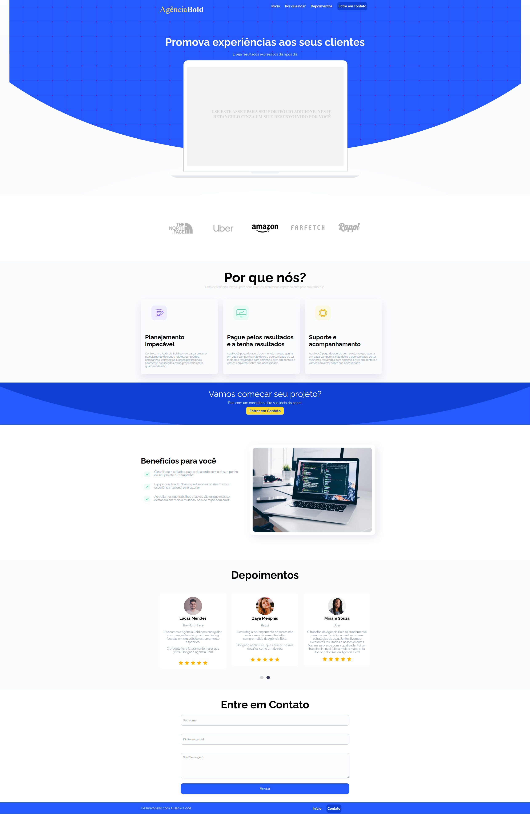

## Descrição
Este projeto consiste em um site fictício para uma agência de marketing chamada "Agência Bold". O site é desenvolvido em HTML, CSS e JavaScript, com a ajuda da biblioteca jQuery e do Slick Carousel. Ele tem como objetivo apresentar a agência, seus serviços, depoimentos de clientes e os benefícios de trabalhar com ela.

## Tecnologias Utilizadas
- HTML
- CSS
- JavaScript
- jQuery
- Slick Carousel
- Font Awesome
- Google Fonts

